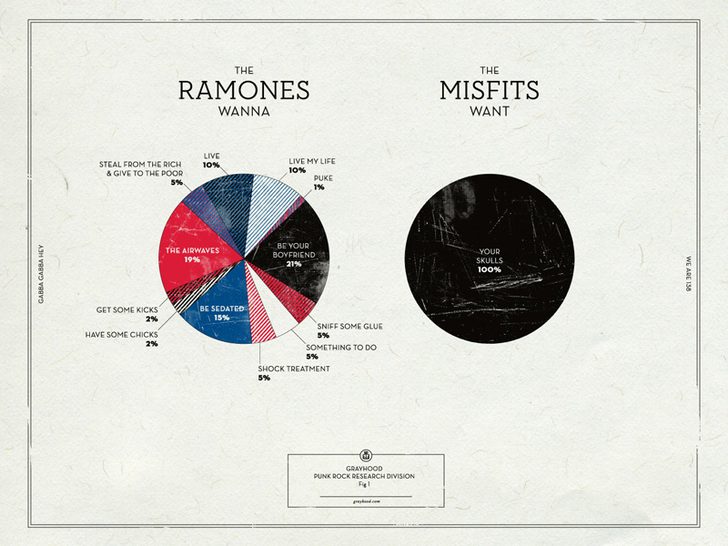

Recently I saw a tweet that shared this hilarious poster.


Dan Gneiding (aka Grayhood) is the graphic designer who created this.  You can buy it [here](http://grayhood.com/shop/ramones-vs-misfits-1-2-3-4th-edition)

Very cool, but how accurate is it?  I asked Dan and says he took some artistic license, as he should! You may accuse me of being that pedantic "Comic Book Guy" from "The Simpsons" but, when I saw it, I immediately wondered how I could tally these Ramones lyrics myself or, rather, get R to do it for me. The `tidytext` mining package makes short work of the project, as we'll see.

<iframe src="https://giphy.com/embed/26tk0Emxz61hdKEog" width="480" height="360" frameBorder="0" class="giphy-embed" allowFullScreen></iframe><p><a href="https://giphy.com/gifs/season-13-the-simpsons-13x8-26tk0Emxz61hdKEog">via GIPHY</a></p>

The Ramones hold a special place in my heart. As a college student in central Ohio, in the late 70s, my frat brothers and I were huge fans.  We were completely ridiculous of course. Preppy nerds bobbing to "Beat on the Brat"  The Sigma Chis thought we were idiots (Lynrd Skynrd? Come on! History has judged). I never saw the Ramones at CBGBs but when we heard they were coming to a cowboy bar on notorious High St. across from Ohio State, we were thrilled.  I blew off studying for a Poly-Sci mid-term the next day.  I got my worst college grade ever but it was totally worth it. I said my future self would thank me and I was right!

Without any further adieu, hey, ho, let's go!


```{r message=FALSE, warning=FALSE}
#devtools::install_github("dmi3kno/polite")
library(tidyverse)
library(tidytext)
library(rvest)
library(polite)
library(reshape2)
library(wordcloud)
library(scales)
library(ggthemes)
library(genius)

# very dark theme for ggplot courtesy of
#https://gist.github.com/jslefche/eff85ef06b4705e6efbc
source("ggplot_theme_black.r")

```

```{r}
#make sure you have a Genius API token
# my token is in the .Reviron file

ramones_albums <- tribble(
  ~album, ~year,
  "Ramones", 1976,
  "Leave Home", 1977,
  "Rocket To Russia", 1977,
  "Road To Ruin", 1978,
  "End Of The Century", 1980,
  "Pleasant Dreams", 1981,
  "Subterranean Jungle", 1983,
  "Too Tough To Die", 1984,
  "Animal Boy", 1986,
  "Halfway To Sanity",1987,
  "Brain Drain",1989,
  "Mondo Bizarro",1992,
  "Acid Eaters",1993,
  "¡Adios Amigos!",1995
)
artist_albums <- ramones_albums %>% 
  mutate(artist="Ramones") %>% 
  select(artist,album) %>%
  {.}

if (file.exists("data/ramones_lyrics_genius.rdata")){
  load("data/ramones_lyrics_genius.rdata")
} else {
  ramones_lyrics_genius <- genius::add_genius(artist_albums,artist,album)
  save(ramones_lyrics_genius,file="data/ramones_lyrics_genius.rdata")
}

```


Most projects require a huge amount of data wrangling before we can get any real analysis done.  This project is pretty clean.  We are already nearly good to go.  Further, `tidytext` makes the remaining manipulation of the data soooo easy!  To wit, let's tokenize the data into individual words.
```{r}
#lyric_words <- ramones_lyrics %>% select(-band,-lyric_url) %>% unnest_tokens(word,lyrics)
ramones_lyrics <- ramones_lyrics_genius
lyric_words <- ramones_lyrics  %>% 
  unnest_tokens(word,lyric) %>%
  rename(song_name=track_title)
```
That's it!  Before we look at the what the Ramones want we might as well run the, now routine, sentiment analysis you may have learned about from Julia Silge and David Robinson [here](https://cran.r-project.org/web/packages/tidytext/vignettes/tidytext.html).  The Ramones are no Jane Austen but, hey, they have feelings, ya know?

To start our sentiment analysis let's pull out stop words that don't provide much context.
```{r}
lyric_words_cleaned <- lyric_words %>% anti_join(get_stopwords(),by="word")

#quick sentiment analysis
positive <- get_sentiments("bing") %>%
  filter(sentiment == "positive")

negative <- get_sentiments("bing") %>%
  filter(sentiment == "negative")

lyric_words_cleaned %>%
  semi_join(positive,by="word") %>%
  group_by(song_name) %>% 
  count(word) %>% 
  group_by(song_name) %>% 
  tally(sort = TRUE,name="Happy Words")
  
```

```{r}
lyric_words_cleaned %>%
  semi_join(negative,by="word") %>%
  group_by(song_name) %>% 
  count(word) %>% 
  group_by(song_name) %>% 
  tally(sort = TRUE,name="Sad Words")
  

```

```{r}
lyric_words_cleaned %>%
  inner_join(get_sentiments("bing"),by="word") %>%
  group_by(song_name) %>% 
  count(sentiment,sort=TRUE) %>% 
  mutate(n = ifelse(sentiment == "negative", -n, n)) %>%
  group_by(song_name) %>% 
  summarise(net_sentiment=sum(n)) %>% 
  filter(abs(net_sentiment) > 10) %>%
  mutate(song_name = reorder(song_name, net_sentiment)) %>%
  mutate(sentiment=ifelse(net_sentiment<0,"Negative","Positive")) %>% 
  ggplot(aes(song_name, net_sentiment, fill = sentiment)) +
  geom_col() +
  coord_flip() +
  labs(title="How Happy are RAMONES Songs?",
       y = "Balance of Postive to Negative Words",
       x= "") +
    theme_black() +
  scale_fill_manual(values = c("red","darkgrey"))+
  theme(axis.text.y =  element_text(size=7,hjust=1)) 
```

What is overall sentiment?
"Sentiment" is a funny thing.  We can guess at the sentiment of words without context but we can't be sure.  Certainly "punk" is not a negative word in the world of the Ramones so we should probably filter that out.
```{r}
lyric_words_cleaned %>%
  filter(word != "punk") %>% 
  inner_join(get_sentiments("bing"),by="word") %>%
  count(sentiment,sort=TRUE) %>% 
  ggplot(aes(sentiment, n, fill = sentiment)) +
  geom_col() +
  labs(title="How Happy are the RAMONES?",
       y = "Word Count (excluding 'Punk')",
       x= "") +
    theme_black() +
  scale_fill_manual(values = c("red","darkgrey"))+
  theme(axis.text.y =  element_text(size=7,hjust=1)) 

```
```{r}
{par(bg="black")
lyric_words_cleaned %>%
  inner_join(get_sentiments("bing"),by="word") %>%
  count(word, sentiment, sort = TRUE) %>%
  acast(word ~ sentiment, value.var = "n", fill = 0) %>%
#  comparison.cloud(colors = c("#F8766D", "#00BFC4"),
#                   max.words = 100)
  comparison.cloud(colors = c("red", "grey60"),
                   max.words = 100,
                   title.bg.colors="grey60")
}
```

Now lets find what the Ramones Want.  An n-gram is simply a cluster of words of length n.  Let's look at the most common n-grams, which would include the phrases like "I want" and "I wanna."

Start with shortest n-gram that is a complete thought and work up to longer phrases.  We take the the shortest phrase that makes sense unless appending more words doesn't change the frequency.  Then we take the longer phrase.  For instance if "I wanna steal some money" and "I wanna steal from the rich" both exist we take "I wanna steal" since it would have a higher frequency than either longer phrase.  In this case, the only phrase starting with "I wanna steal"  is "I wanna steal from the rich" so we use that.
```{r}
want_phrases <- "^(i wanna |i want |we want |we wanna |i wanted |i just want |i just wanna )"

get_ngrams <- function(lyrics,n,prefixes=""){
  min_instance = 0
  lyric_ngram <- lyrics %>% 
#    select(-band,-lyric_url) %>% 
    unnest_tokens(ngram,lyric,token = "ngrams",n=n) %>% 
    group_by(ngram) %>% 
    filter(str_detect(ngram,prefixes)) %>% 
    count() %>% 
    arrange(desc(n)) %>% 
    filter(n>min_instance) %>% 
    mutate(want=str_remove(ngram,prefixes)) %>% 
   rowid_to_column()
  return(lyric_ngram)
  
}

want <- ramones_lyrics %>% get_ngrams(5,want_phrases)
want
```

What a human needs to do is decide which phrases are complete thoughts.  We manually select the row numbers to build our ultimate table and build a longer n-gram table to flesh out those that are not.

Remember what I said before about data wrangling?  Well, getting the words was easy.  Determining meaningful phrases is not.  If this was Spotify, our AI could figure these out, but it is not Spotify. This is a manual,iterative process of taking ever-longer n-grams until we don't see any sensible new phrases.  I won't bore you with every iteration so let's skip ahead.

```{r}
# make "wanna" in to "want to" which also frequently appears so we get a good count.
ramones_lyrics <- ramones_lyrics %>% mutate(lyric=str_replace_all(lyric,"wanna","want to"))
do_want <- tibble()
all_wants <- tibble() # for debugging
# why make the code below a function, if we only call it once?
# Since we cumulatively modify all_wants each step is dependent on the prior one executing first
# this organizes the code into a block that tells future self to execute as a block
build_wants <- function(all_wants) {
  want_phrases <- "^(i wanna |i want |we want |we wanna |i wanted |i just want |i just wanna )"
  #select the 3-gram phrases that are complete thoughts using manual inspection
  want <- ramones_lyrics %>% get_ngrams(3,want_phrases)
  all_wants <- bind_rows(all_wants,want[c(2,8,11,13),])
  # move to the 4-gram phrases, etc
  want <- ramones_lyrics %>% get_ngrams(4,want_phrases)
  all_wants <- bind_rows(all_wants,want[c(5,6,7,9,13,14,17,24,28,30,31,37),])
  want <- ramones_lyrics %>% get_ngrams(5,want_phrases)
  all_wants <- bind_rows(all_wants,want[c(3,4,6,9,21,22),])
  want <- ramones_lyrics %>% get_ngrams(6,want_phrases)
  all_wants <- bind_rows(all_wants,want[c(1,11,12,22,25,28),])
  want <- ramones_lyrics %>% get_ngrams(7,want_phrases)
  #want
  all_wants <- bind_rows(all_wants,want[c(5,6,7,9,10,12,21),])
  want <- ramones_lyrics %>% get_ngrams(8,want_phrases)
  #want
  all_wants <- bind_rows(all_wants,want[c(7,3),])
  return (all_wants)
}

do_want <- build_wants(do_want)
do_want <- do_want %>% 
  group_by(want) %>% 
  summarise(n=sum(n)) %>% 
  arrange(desc(n))
do_want
```
Clean up the text and tally the instances of each want.
```{r}
do_want_clean <- do_want %>% 
#  mutate(want = str_remove(want,"^to |ed |wanna |^was to |^is |^be with ")) %>% 
  mutate(want=str_to_title(want)) %>% 
  group_by(want) %>%
  summarise(n=sum(n)) %>% 
  arrange(desc(n))
do_want_clean
```

```{r}
do_want_clean %>% mutate(want=reorder(want,n)) %>% 
  ggplot(aes(want,n)) + geom_col()+coord_flip() +
  theme_black() +
  theme(axis.text.y = element_text(hjust=1,size=10))+ 
  scale_fill_manual(values = c("red","darkgrey"))

```
What DON'T the Ramones want? Once again, we go through the same iterative process with different phrase stems.
```{r}
dont_want <- tibble()
all_wants <- tibble() # for debugging only
ramones_lyrics <- ramones_lyrics %>% mutate(lyrics=str_replace_all(lyrics,"wanna","want to"))
want_phrases <- "^(i don't want |we don't want |i didn't want )"
build_dont_wants <- function(all_wants) {
  want <- ramones_lyrics %>% get_ngrams(4,want_phrases) %>% mutate(n = -n)
  all_wants <- bind_rows(all_wants,want[c(2),])
#  want
  want <- ramones_lyrics %>% get_ngrams(5,want_phrases) %>% mutate(n = -n)
  #want
  all_wants <- bind_rows(all_wants,want[c(4,5,6,10,12),])
  want <- ramones_lyrics %>% get_ngrams(6,want_phrases) %>% mutate(n = -n)
  #want
  all_wants <- bind_rows(all_wants,want[c(1),])
  want <- ramones_lyrics %>% get_ngrams(7,want_phrases) %>% mutate(n = -n)
#  want
  all_wants <- bind_rows(all_wants,want[c(2,30,31,33),])
  want <- ramones_lyrics %>% get_ngrams(8,want_phrases) %>% mutate(n = -n)
#  want
  all_wants <- bind_rows(all_wants,want[c(13,14,18,29,34),])
  want <- ramones_lyrics %>% get_ngrams(9,want_phrases) %>% mutate(n = -n)
#  want
  all_wants <- bind_rows(all_wants,want[8,])
  want <- ramones_lyrics %>% get_ngrams(10,want_phrases) %>% mutate(n = -n)
#  want
  #there it is - Pet Sematary!
  all_wants <- bind_rows(all_wants,want[c(2),])
}
dont_want <- build_dont_wants(dont_want)
dont_want <- dont_want %>% arrange(n) %>% select(-rowname)
dont_want_clean <- dont_want %>% 
#  mutate(want = str_remove(want,"^to |ed |wanna |^was to |^is |^be with ")) %>% 
  mutate(want=str_to_title(want)) %>% 
  group_by(want) %>%
  summarise(n=sum(n)) %>% 
  arrange(n)
dont_want_clean
```


```{r}
ultimate_want <- bind_rows(do_want_clean,dont_want_clean) %>% 
  group_by(want) %>%
  summarise(n=sum(n)) %>%   
  mutate(sentiment = ifelse(n > 0,"want","don't want")) %>% 
  arrange(n) %>% 
#  mutate(want=str_to_title(want)) %>% 
  {.}
ultimate_want
```

```{r}
p <- ultimate_want %>% mutate(want=reorder(want,n)) %>% 
  ggplot(aes(want,n,fill=sentiment)) + geom_col()+coord_flip()+
  labs(title="What Do The RAMONES Want?",
       y="How Much Do The RAMONES Want It?",
       x="") + theme_black()
p + 
  scale_fill_manual(values = c("red","darkgrey"))+
  theme(axis.text.y =  element_text(size=7,hjust=1)) 
```

Sometimes, late at night, after everyone else is asleep, I hide under the covers, open my laptop and look at... pie charts. Ed Tufte says I will go blind if I keep doing it.  Still, for the sake of bringing this full circle let's make a version of Grayhood's poster with our data.  So it's not a complete mess we lump any phrases that occur less than 4 times in "Other."  That takes some of the fun out of things since we lose memorable phrases like "I wanna sniff some glue" which the poster above includes.  This is data science, not art.  It's not supposed to be fun! While I use ggplot2 pretty much exclusively, the base R `pie` plot produces pretty clean results that approximate the style of the poster with no embellishment. 

```{r}
collapsed_want <- ultimate_want %>%
  filter(sentiment=="want") %>%
  mutate(want = ifelse(n<3,"Other",want)) %>%
  group_by(want) %>% 
  summarise(n=sum(n)) %>% 
  arrange(desc(n)) %>% 
  {.}

 with(collapsed_want,
      pie(n, 
          labels=paste0(as.character(want), " ", n, "%"),
          col=c("brown","red","black","darkblue","pink","purple"),
          radius=1,
          density=30,
          bg="sienna",
          main="The Ramones Want..."))
```

```{r}
collapsed_want <- ultimate_want %>%
  filter(sentiment=="don't want") %>%
  mutate(n = -n) %>% 
  mutate(want = ifelse(n<2,"Other",want)) %>%
  group_by(want) %>% 
  summarise(n=sum(n)) %>% 
  arrange(desc(n)) %>% 
  {.}

 with(collapsed_want,
      pie(n, 
          labels=paste0(as.character(want), " ", n, "%"),
          col=c("brown","red","black","darkblue","pink","purple"),
          radius=1,
          density=30,
          bg="sienna",
          main="The RAMONES Don't Want..."))
```


